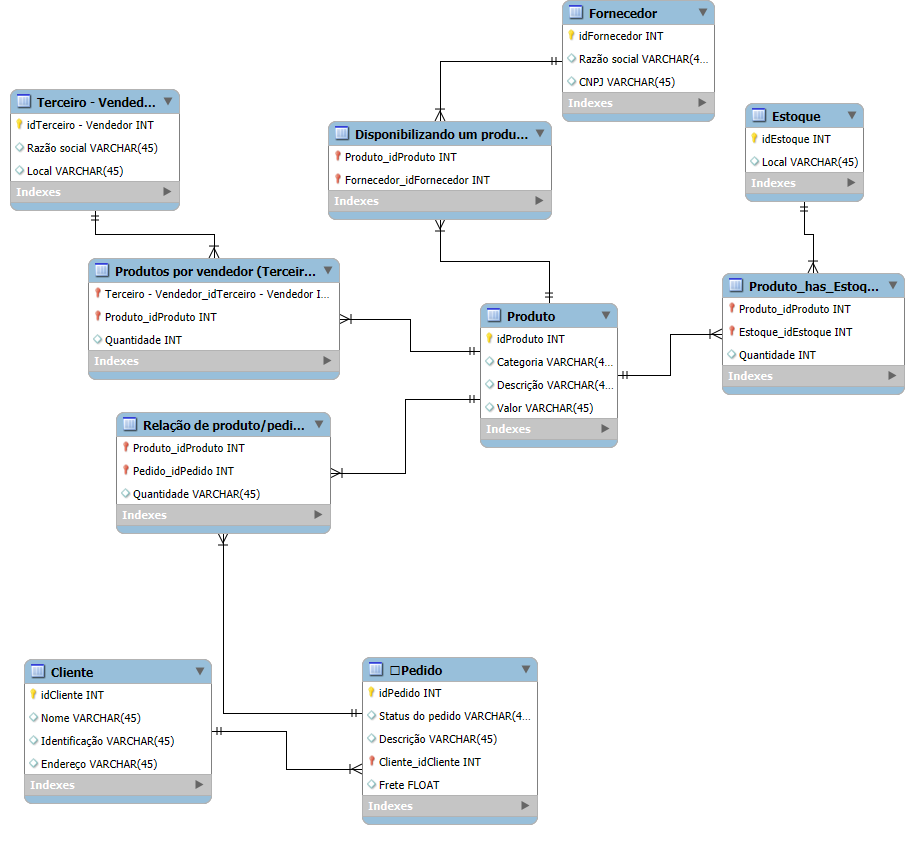
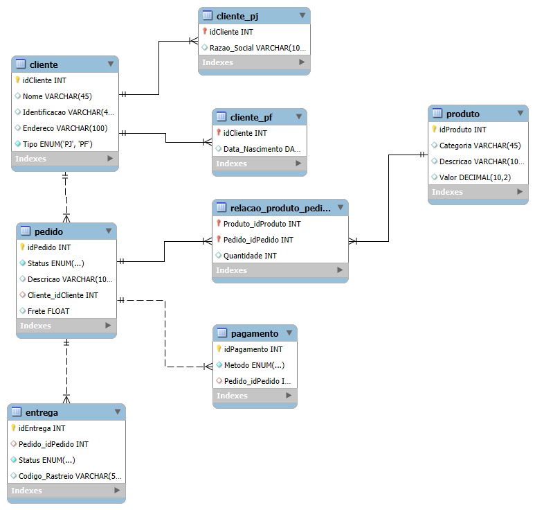

# 📦 Refinando um Projeto Conceitual de Banco de Dados – E-COMMERCE

## 📌 Descrição
Este projeto consiste na modelagem de um banco de dados para um sistema de e-commerce. O modelo foi refinado com melhorias como diferenciação entre clientes Pessoa Física (PF) e Pessoa Jurídica (PJ), suporte a múltiplas formas de pagamento e controle de entregas com status e código de rastreio.

📌 *Projeto desenvolvido como parte de um desafio de modelagem de banco de dados pela DIO (Digital Innovation One) no bootcamp Heineken - Inteligência Artificial Aplicada a Dados com Copilot.*

## 🎯 Objetivo do Desafio
Refine o modelo apresentado acrescentando os seguintes pontos:
- **Cliente PJ e PF** – Uma conta pode ser PJ ou PF, mas não pode ter as duas informações.
- **Pagamento** – Pode ter cadastrado mais de uma forma de pagamento.
- **Entrega** – Possui status e código de rastreio.

## 🏗 Estrutura do Banco de Dados
O banco de dados contém as seguintes tabelas principais:

### 1️⃣ **Cliente**
Armazena informações básicas dos clientes, incluindo CPF ou CNPJ, endereço e o tipo de cliente (PJ ou PF).

### 2️⃣ **Cliente_PJ e Cliente_PF**
Tabelas específicas para armazenar informações adicionais:
- **Cliente_PJ** contém a Razão Social.
- **Cliente_PF** contém a Data de Nascimento.

### 3️⃣ **Produto**
Armazena os produtos disponíveis na loja, incluindo categoria, descrição e valor.

### 4️⃣ **Pedido**
Registra os pedidos realizados pelos clientes, incluindo status e frete.

### 5️⃣ **Relação Produto/Pedido**
Relaciona os produtos e os pedidos, indicando a quantidade de cada item em um pedido.

### 6️⃣ **Pagamento**
Permite que cada pedido tenha múltiplas formas de pagamento, como Cartão de Crédito, Boleto, PIX ou Transferência.

### 7️⃣ **Entrega**
Armazena as informações sobre a entrega dos pedidos, incluindo status e código de rastreamento.

## 📜 Modelo Conceitual

### Diagrama Inicial
O diagrama inicial do banco de dados é mostrado abaixo:



### Diagrama Refinado
O diagrama foi refinado para incluir as novas tabelas e relações, garantindo uma estrutura mais robusta para o sistema de e-commerce:



## 🚀 Como Usar
1. Clone o repositório:  
   ```sh
   git clone https://github.com/DandanLeinad/desafio-dio-mysql.git
   ```
2. Importe o script SQL no seu editor SQL compatível com MySQL:
    
     - **Opção 1: Usando MySQL Workbench**:
         1. Abra o MySQL Workbench.
         2. Conecte-se ao servidor MySQL.
         3. Abra o script SQL copiado e cole em um novo arquivo.
         4. Execute o script clicando no ícone de execução.
    
     - **Opção 2: Usando outro editor SQL (DBeaver, HeidiSQL, phpMyAdmin, etc.)**:
         1. Abra o editor SQL da sua preferência.
         2. Conecte-se ao servidor MySQL.
         3. Abra o script SQL copiado ou faça o upload do arquivo `ecommerce.sql`.
         4. Execute o script para criar as tabelas no banco de dados.

## 📌 Tecnologias Utilizadas
- MySQL
- Modelagem Relacional
- SQL

## 📢 Contribuição
Fique à vontade para contribuir! Sugestões e melhorias são bem-vindas.